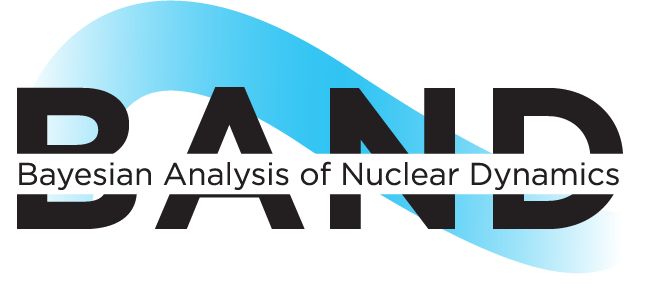

# BAND Framework
This contains the primary public repository for the [BAND framework project](https://bandframework.github.io/). 

## Goals

The Bayesian Analysis for Nuclear Dynamics (BAND) software Framework provides tools and examples that 
facilitate principled Uncertainty Quantification in Nuclear Physics. 

This framework is funded by the NSF Office of Advanced Cyberinfrastructure, Cyberinfrastructure for Sustained Scientific Innovation program, under grant OAC-2004601.

We provide tools and examples that demonstrate how
- emulation of computationally expensive models,
- model calibration, and
- Bayesian model mixing

can be combined in order to provide a full accounting of the uncertainties in Nuclear Physics models–-including model
uncertainty.

These tools are designed to:
- enable predictions with full UQ for experimentally inaccessible environments such as neutron stars.
- when combined with code that implements Bayesian experimental design methodology, permit a quantitative assessment of the impact of proposed experiments.

More about the goals and structure of the BAND project can be found in D.R. Phillips et al., "[Get on the BAND Wagon: a Bayesian framework for quantifying model uncertainties in nuclear dynamics"](https://doi.org/10.1088/1361-6471/abf1df), J. Phys. G **48** (2021) 7, 072001.

A full list of BAND members, together with a current list of  publications produced by the members using the tools and ideas of the project, is available at https://bandframework.github.io.

## BAND Framework Elements

BAND Framework elements are of three main types:
- BAND software: these are software tools that can be invoked to perform specific emulation, calibration, model-mixing, experimental-design, or linkage functions.
- BAND software uses: these are analyses that employ BAND software to solve a nuclear physics problem. 
- BAND examples: these are stand-alone notebooks or code that provide examples of principled Bayesian uncertainty quantification. They are constructed to solve a particular nuclear physics problem. They do not use any of the BAND software tools, but contain software that BAND Framework users may wish to adapt to other scientific contexts. 

The BAND Framework's software tools can be found in [software/](/software/). 
As of version 0.5.0+dev, the following tools are included:
- Bfrescox ([v0.0.1-alpha](https://github.com/bandframework/Bfrescox/releases/tag/v0.0.1-alpha )): A Python wrapper for the Frescox coupled reaction channel code.
- jitr ([v3.0](https://github.com/beykyle/jitr/releases/tag/v2.5.1 )): A Python package containing a Lagrange mesh R-matrix solver for parametric reaction model calibration.
- LCGP ([v1.1.1](https://github.com/mosesyhc/lcgp/releases/tag/1.1.1 )): A Gaussian process surrogate model for emulating stochastic simulation outputs.
- OpenBT ([v1.2.0](https://github.com/bandframework/OpenBT/releases/tag/v1.2.0)): C++, Python, and R packages implementing Bayesian tree models, including regression, model mixing, sensitivity analysis and multiobjective optimization.
- parMOO ([v0.5.1](https://github.com/parmoo/parmoo/releases/tag/v0.5.1 )): A Python library for parallel multiobjective simulation optimization.
- PUQ ([v0.1.1](https://github.com/parallelUQ/PUQ/releases/tag/v0.1.1 )): A Python package for generating experimental designs tailored for uncertainty quantification and featuring parallel implementations.
- pybmc ([v0.2.4](https://github.com/ascsn/pybmc/releases/tag/v0.2.4 )): A Python package for performing Bayesian model combination on various predictive models.
- [SmoothEmulator](/software/SmoothEmulator): A simplex sampler, emulator trainer, and MCMC explorer that employs a smooth emulator.
- surmise ([v0.4.0](https://github.com/bandframework/surmise/releases/tag/v0.4.0 )): A surrogate model interface for calibration, uncertainty quantification, and sensitivity analysis.
- Taweret ([v1.2.0](https://github.com/bandframework/Taweret/releases/tag/v1.2.0 )): A Python package containing multiple Bayesian Model Mixing methods.
- rose ([v1.1.8](https://github.com/bandframework/rose/releases/tag/v1.1.8 )): A reduced-order scattering emulator. Note: no longer maintained, see [software/rose/README.md](https://github.com/bandframework/rose/blob/v1.1.8/README.md) for details.

As of version 0.5.0+dev, [BANDsoftware_uses/](/BANDsoftware_uses/) contains the following examples of the application of one or more of the above BAND software tools to nuclear physics problems:
- [Bfrescox + surmise](/BANDsoftware_uses/Bfrescox): combining the Frescox scattering code with surmise to enable Bayesian parameter estimation for coupled-channels scattering.
  
The following [examples](/examples/) are included in version 0.5.0+dev:
- BMEX ([v0.1.4](https://github.com/massexplorer/bmex-masses/releases/tag/v0.1.4 )): A web application for exploring quantified theoretical model predictions of nuclear masses and related quantities.
- [BRICK](/examples/BRICK): The Bayesian R-matrix Inference Code Kit, designed to facilitate extraction of R-matrix parameters from experimental data.
- ModelDiscrepancy ([v1.1.0](https://github.com/sjaiswal-tifr/ModelDiscrepancy/releases/tag/v1.1.0 )): A Bayesian framework for model-data comparison that accounts for theoretical uncertainties.
- neutron-rich-bmm ([v0.1.0](https://github.com/asemposki/neutron-rich-bmm/releases/tag/v0.1.0 )): An example of Gaussian process Bayesian model mixing for the dense matter equation of state.
- [nuclear_saturation](https://github.com/cdrischler/nuclear_saturation/tree/c4cfa45a1180b2739e217102d7380736d6844a11): A Bayesian mixture model approach to quantifying the empirical nuclear saturation point.
- [QGP_Bayes](https://github.com/danOSU/QGP_Bayes/tree/4b3e2364f87a29ad2469f2b072053420fdaac8e9): A tutorial on the use of JETSCAPE_SIMS tools to infer parameters of the QGP.
- SaMBA ([v1.2.1](https://github.com/asemposki/SAMBA/releases/tag/v1.2.1 )): The Sandbox for Mixing via Bayesian Analysis.

## Downloading and using the BAND Framework

You are free to use any pieces of the BAND Framework that will advance your own research. Please cite the framework and the original BAND paper, as detailed below under "Citing the BAND Framework".

## Submodules

The bandframework repository currently includes some dependencies via git submodules. Currently, submodules are employed in the directories:

* [examples/](examples/)
* [software/](software/)

As a consequence, when cloning bandframework, the submodules can be retrieved automatically via
- `git clone --recursive` (in place of the usual `git clone`)

If you have already cloned the repository, the following modified `git` commands can be used:
- `git submodule update --init --recursive` (to obtain all submodules and any submodules those submodules have)
- `git pull --recurse-submodules=yes` (in place of the usual `git pull`)
- `git submodule update --init` (additionally, after `git pull`)
- `git submodule update --init software/surmise`
  (variant of the previous item, in case you want to only get the surmise submodule)

In each BAND Framework release, the hash for a particular submodule is set to a specific commit of the associated software element. While serious bug fixes in a submodule will occasion a new BAND Framework release, some pieces of software may extend functionality without the tag here in the framework being updated. To ensure you are using the version of submoduled software appropriate for your research application, you should consult the release history of that piece of software. 

Note that submodules work on modern git (i.e., version >= 2.38.0).

## Contributing to the BAND Framework

BAND welcomes contributions to the BAND Framework in a variety of forms; please see [CONTRIBUTING](CONTRIBUTING.rst).

The BAND Framework maintains a [BAND Software Development Kit (SDK)](/resources/sdkpolicies/bandsdk.md) that includes requirements and recommendations for contributing a package to the BAND Framework. 

Detailed instructions for contributing software, including by submodules, are found in BAND's [developer's guide](/resources/dev_guide).

## License 

All code included in the BAND Framework is open source, with the particular form of license contained in the top-level subdirectories of [software/](/software/), [examples/](/examples/), and [BANDsoftware_uses/](/BANDsoftware_uses/).  If such a subdirectory does not contain a LICENSE file, then it is automatically licensed as described in the otherwise encompassing BAND Framework [LICENSE](/LICENSE).  

## Citing the BAND Framework

Please use the following to cite the BAND Framework:

    @techreport{bandframework,
        title       = {{BANDFramework: An} Open-Source Framework for {Bayesian} Analysis of Nuclear Dynamics},
        author      = {Kyle Beyer and Landon Buskirk and Manuel Catacora Rios and Moses Y.-H. Chan and Tyler H. Chang and Troy Dasher 
        and Richard James DeBoer and Christian Drischler and Richard J. Furnstahl and Pablo Giuliani and Kyle Godbey 
        and Edbert Handjaja and Kevin Ingles and Sunil Jaiswal and An Le and Dananjaya Liyanage and Filomena M. Nunes
        and Daniel Odell and David O'Gara and Jared O'Neal and Daniel R. Phillips and Matthew Plumlee
        and Matthew T. Pratola and Scott Pratt and Oleh Savchuk and Alexandra C. Semposki and \"Ozge S\"urer and 
        Stefan M. Wild and John C. Yannotty},
        institution = {},
        number      = {Version 0.5.0+dev},
        year        = {2025},
        url         = {https://github.com/bandframework/bandframework}
    }
    
If possible, please also cite the original BAND Framework paper:

    @article{Phillips:2020dmw,
        author = "Phillips, D. R. and others",
        title = "{Get on the BAND Wagon: A Bayesian Framework for Quantifying Model Uncertainties in Nuclear Dynamics}",
        eprint = "2012.07704",
        archivePrefix = "arXiv",
        primaryClass = "nucl-th",
        doi = "10.1088/1361-6471/abf1df",
        journal = "J. Phys. G",
        volume = "48",
        number = "7",
        pages = "072001",
        year = "2021"
    }

Please also cite any of the underlying BAND Framework packages you employ, each of which includes citation or documentation information.

## Resources
For more information, please see the [BAND framework website](https://bandframework.github.io/). 

Our [release process](resources/dev_guide/release-proc.rst) is also provided.

## Acknowledgment
The BAND Framework is supported by the National Science Foundation [Cyberinfrastructure for Sustained Scientific Innovation program](https://www.nsf.gov/funding/opportunities/cssi-cyberinfrastructure-sustained-scientific-innovation) under grant OAC-2004601.
