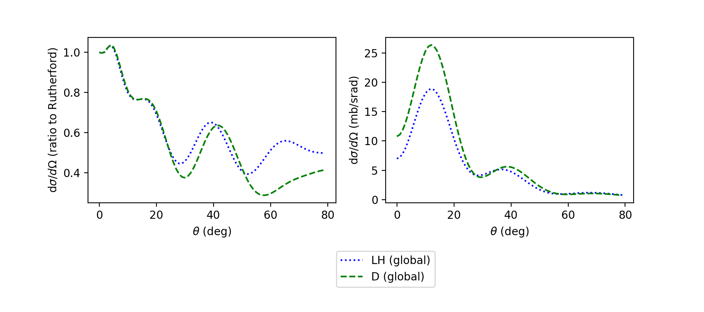
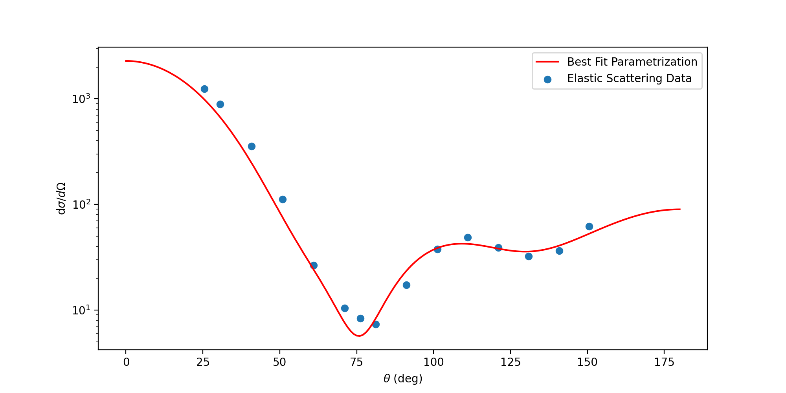
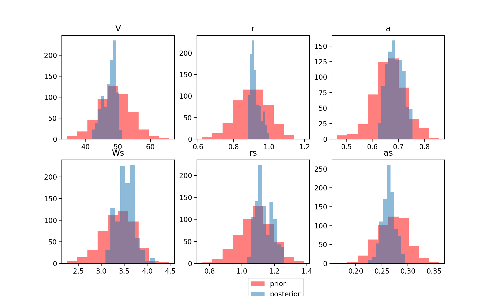
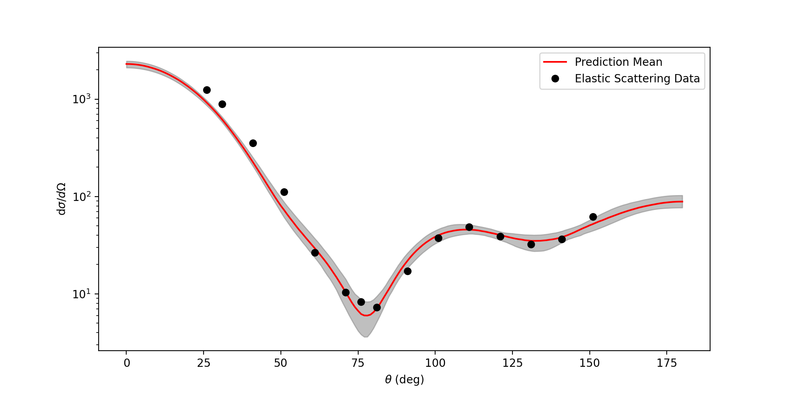

Tutorial I: Interfacing frescox with surmise
==============================================

Verification
++++++++++++++++++++++++++++++++++++++++++++++++++++++++++++

First, we will verify that ``frescox`` works as expected when called from Python. Additional notes on obtaining and building ``frescox`` can be found at <https://github.com/bandframework/privateband/tree/team/Software/Frescox/README.md>.

To do that, we use a single-neutron transfer reaction, 48Ca(d,p)49Ca, which should reproduce the blue dotted and green dashed curves in Fig. 1 of `Lovell and Nunes, J. Phys. G: Nucl. Part. Phys. 2015 [doi:10.1088/0954-3899/42/3/034014]. <https://iopscience.iop.org/article/10.1088/0954-3899/42/3/034014/pdf>`_

This is a comparison of two different d+48Ca interactions. The corresponding input files are ``LH1048cadp.in`` and ``D1048cadp.in``.
Among other output, this frescox calculation will give us the deuteron elastic scattering cross section (Fig. 1a) and the transfer cross section (Fig. 1b).

First, ensure that the directory ``frescox_outputs`` exists. If it does not, then ``mkdir frescox_outputs``.

In order to obtain the two figures, run::

  python3 cadp.py

Interfacing frescox with the :math:`\\\chi^2` minimization wrapper
++++++++++++++++++++++++++++++++++++++++++++++++++++++++++++++++++++

In this section, we interface with ``frescox`` - the :math:`\\\chi^2` minimization wrapper for frescox. In this case, we need a few extra files.

The simplest example is just elastic scattering of neutrons on 48Ca, 48Ca(n,n)48Ca.  To run `frescox`, three files are needed:

- ``48Ca.in`` - frescox input file
- ``search-el.in`` - sfresco set up file (contains the parameters that are being optimized and the experimental data)
- ``sfresco.in`` - sfresco input file

In order to observe the best fit, run::

  python3 fitted48Ca.py

Interfacing frescox with surmise to perform Bayesian calibration
+++++++++++++++++++++++++++++++++++++++++++++++++++++++++++++++++++++++

In this section, we illustrate how to interface ``frescox`` with ``surmise``, a Python package
for uncertainty quantification. More information about ``surmise`` can be found at <https://surmise.readthedocs.io/en/latest/>.

We demonstrate how ``frescox`` and ``surmise`` work together with two different
examples (please see scripts ``example_surmise1.py`` and ``example_surmise2.py``). In the first example, we fit an emulator to calibrate our computer model.
In the second example, we directly use computer model outputs without fitting an emulator to be used in the calibration.

In order to calibrate our computer code by fitting an emulator, run::

  python3 example_surmise1.py

In this script, ``emu_fresco`` is ``surmise``'s emulator object as a proxy to
the computer code ``frescox``::

  emu_fresco = emulator(x=x_tr,
                        theta=theta_tr,
                        f=f_tr,
                        method='PCGPwM')

To fit a Bayesian calibrator with a Metropolis-Hastings sampler::

    cal_1 = calibrator(emu=emu_fresco,
                       y=y,
                       x=x,
                       thetaprior=prior_fresco_Ca,
                       method='directbayes',
                       yvar=obsvar)

After obtaining the calibrator, we observe the prior and posterior distribution
of the uncertain parameters.

The uncertainty on the posterior predictions is also obtained.

Note that in the script, there are two additional calibrators fitted using
either a different calibration method or a different sampler.

In the second script we illustrate how to use computer simulation output directly without fitting an emulator. In order to perform this example, run::

  python3 example_surmise2.py

The main difference between these two examples is that in the second example an emulator object is defined via::

  emu_fresco = emulator(passthroughfunc=frescox_run)

Here, ``frescox_run`` is a function that executes ``frescox`` with given input
parameter settings, and reads the corresponding output file to get the function evaluations.
